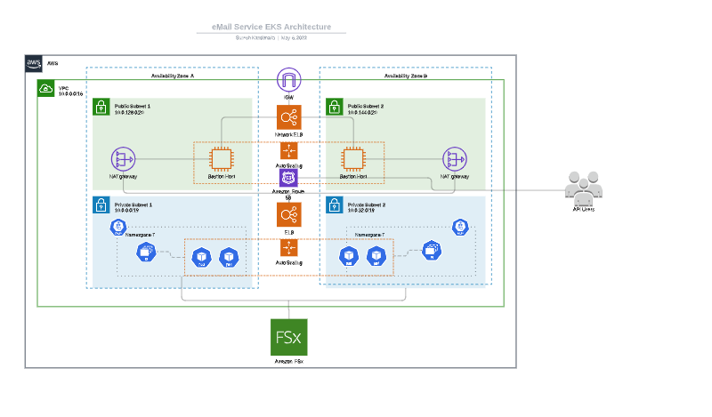
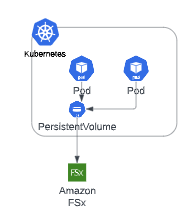

# email-service
## 1. Assumptions
 [Very high level readme is implemented to provide overview of the module, we can discuss  more details during the meeting ]

### 1.1 Security
- For the Service level Security we can enable spring security with OAuth or Token based, did not enable for now , we can discuss during the call

### 1.2 Application logging
- Loging is not implemented can be implemented easily with App logger or AOP based on the scope
### 1.3 Deployment strategy
- using AWS as a cloud provide and K8S implementation assuming there will be amy more services use the frame work
- server less can be implemented AWS lambda or fargate if K8S are not the enterprise strategy
#2. Application Components
###2.1 Implementation Overview
    - Email Micro service is implemented as springboot restfull service
    - it used Springboot mail and thymeleaf starter for the basic HTML emails
    - the email service users will provide the user name and email along with the template name during the rest api calls
    - templates are stored in resource folder in production mode those can be mounted thru persistence volume mounts to each pods by storing the actual template in AWS FSx/EFS
    - **we can use other CMS technologies for the templates 
    - for scheduling email requirements, Spring has another starter quartz for scheduling jobs , components were implemented for scheduling some more coding is needed for complete the task but basic building blocks were added
    - to track the open emails there will small url's will be added to each template and we can track suing the number of hits for the url
    - Application level security can be easily implemented  using Spring security either with token or oAuth
    - Junits , project is setup for running JUnit test cases , implemented couple of happy path scenarios , rest needs to be extended
    - application configurations are in application.properties for now , we can move those configMaps and credentials to AWS secrets 
###2.2 Build and Docker image
    - Application will be build with maven 
    - Sample Dockerfile is implemented in the root file 
###2.3 K8S deployment
    - All the K8S deployment files are stored in "K8S" folders , some configurations needs to be updated to deployed into EKS
    - Storage account, volume mounts and PVC implimentations files are added
    - ALB and ingress controllers will be used to load balancing and exposing the end points were implemented and updated
    - HorizontalPodAutoscaler is implemented and added as per the deployment in "hpa.yaml"
#3. Conceptual AWS Deployment Design

         

    1. Email application users (ApiUser) will use the Application url configured using AWS Route 53
    2. Route 53 will be route the traffic to ELB/ALB thru the urls exposed thru the ingress controller
    3. Application deployed in the EKS cluster will have FSx mounted for the email templates
    4. HorizontalPodAutoscaler will be used for the Node auto scaling.

### 3.1 Security
        1. All the nodes will be created in VPC
        2. Public cluster and bastion will be used to SSH to the servers or any other devOps related activities
        3. AWS security groups and IAM roles will be used to implement more secure services
        4. Application level & role based security can be implemented spring security and OAuth 
### 3.2 Load Balancing & Auto Scaling
        1. Combination of Route53, ALB and Ingress will handle the Load balancing 
        2. HorizontalPodAutoscaler will be used to auto scale the pods based on the load strategy 

#4 . Command to run service

curl -X POST "http://localhost:8080/email" \
-H "Content-Type: application/json" \
--data '{ "name": "Graham Williams",  "email": "xxxxx@gmail.com" }'